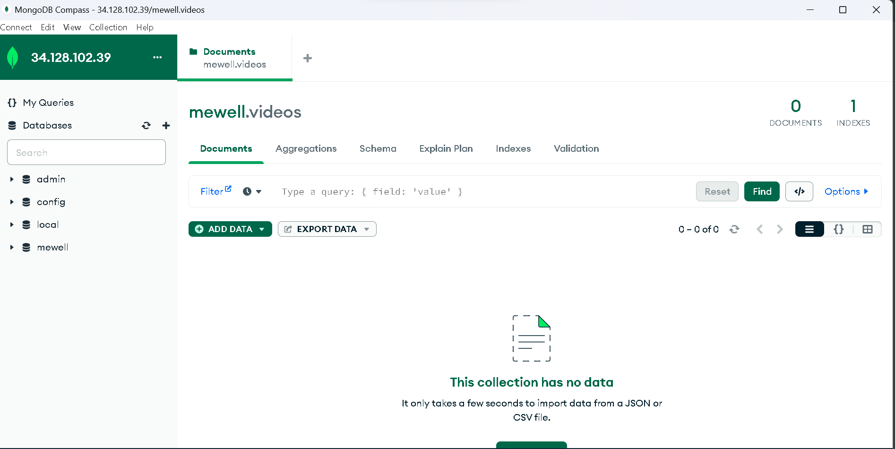

# install mongodb on ubuntu 20.04

https://www.digitalocean.com/community/tutorials/how-to-install-mongodb-on-ubuntu-20-04

1. link untuk menginstall mongodb di compute engine os ubuntu 20.04

1. Untuk menghubungkan MongoDB yang berjalan di Compute Engine di Google Cloud dengan local Compute Engine, Anda dapat mengikuti langkah-langkah berikut:

- Pastikan kedua Compute Engine (Compute Engine di Google Cloud dan local Compute Engine) dapat saling terhubung melalui jaringan. Pastikan tidak ada pembatasan firewall yang menghalangi koneksi antara kedua mesin.
- Dari local Compute Engine, buka terminal atau koneksi SSH ke instance Compute Engine di Google Cloud yang menjalankan MongoDB.
- Di instance Compute Engine di Google Cloud, buka berkas konfigurasi MongoDB (mongod.conf) dengan menggunakan editor teks seperti Nano atau Vim.
- Cari bagian "bindIp" dalam berkas konfigurasi MongoDB. Secara default, nilainya adalah "127.0.0.1", yang berarti MongoDB hanya akan menerima koneksi dari localhost. Anda perlu mengubah nilainya agar MongoDB menerima koneksi dari alamat IP Compute Engine di Google Cloud dan juga dari alamat IP local Compute Engine. Untuk mengizinkan koneksi dari alamat IP yang spesifik, Anda dapat menambahkan alamat IP tersebut ke dalam nilai "bindIp" atau menggantinya dengan "0.0.0.0" untuk mengizinkan koneksi dari semua alamat IP. Misalnya, jika alamat IP local Compute Engine adalah 192.168.0.100 dan alamat IP Compute Engine di Google Cloud adalah 10.0.0.2, Anda bisa mengkonfigurasi "bindIp" menjadi: "bindIp: 127.0.0.1,192.168.0.100,10.0.0.2".

```
sudo nano /etc/mongod.conf

cara mengubahnya to 0.0.0.0
```

- Simpan perubahan pada berkas konfigurasi MongoDB dan restart layanan MongoDB untuk menerapkan perubahan tersebut. Anda dapat menggunakan perintah sudo service mongod restart atau sudo systemctl restart mongod tergantung pada distribusi Linux yang Anda gunakan.
- Setelah layanan MongoDB diinstance Compute Engine di Google Cloud sudah di-restart, MongoDB akan menerima koneksi dari alamat IP yang telah diizinkan.
- Dari local Compute Engine, Anda dapat menggunakan klien MongoDB seperti MongoDB Shell atau aplikasi lain yang mendukung MongoDB untuk terhubung ke MongoDB di Compute Engine di Google Cloud menggunakan alamat IP publik atau privat Compute Engine tersebut. Misalnya, jika alamat IP publik Compute Engine adalah 34.128.102.39, Anda dapat menggunakan perintah mongo --host 34.128.102.39 pada local Compute Engine untuk terhubung ke MongoDB.
- Pastikan untuk mengamankan koneksi dan mengimplementasikan langkah-langkah keamanan tambahan yang diperlukan untuk melindungi database MongoDB Anda, seperti mengaktifkan autentikasi dan mengenkripsi komunikasi dengan SSL/TLS.
  
  tara sudah terhubung ke local

As mentioned previously, the systemctl status command checks the status of the MongoDB service:

```
sudo systemctl status mongod
```

You can stop the service anytime by typing:

```
sudo systemctl stop mongod
```

To start the service when it’s stopped, run:

```
sudo systemctl start mongod
```

You can also restart the server when it’s already running:

```
sudo systemctl restart mongod
```

In Step 2, you enabled MongoDB to start automatically with the server. If you ever wish to disable this automatic startup, type:

```
sudo systemctl disable mongod
```

Then to re-enable it to start up at boot, run the enable command again:

```
sudo systemctl enable mongod
```

# cara menginstall nodenya dari nvm

https://www.dicoding.com/academies/342/tutorials/20917 disini

> dont forget to restart ssh connection after install nvm because nvm command not found

# nginx

setelah aplikasi berjalan di port 5000 ubah configurasi nginx 80 untuk http 443 untuk https

install nginx
- sudo apt update
- sudo apt install nginx


Untuk mengonfigurasi Nginx agar mengakses port 5000 secara lokal sebagai default, Anda perlu melakukan beberapa langkah berikut:

1. Buka file konfigurasi default Nginx dengan menggunakan editor teks seperti Nano atau Vim:

```
sudo nano /etc/nginx/sites-available/default
sudo nano /etc/nginx/sites-available/domain.com
sudo nano /etc/nginx/sites-available/backend-mewell.biz.id
```

2. Dalam file konfigurasi Nginx, temukan blok server dan hapus atau komentari semua baris di dalamnya.

3. Tambahkan konfigurasi berikut untuk mengarahkan lalu lintas ke port 5000:

```
server {
    listen 80 default_server;
    listen [::]:80 default_server;

    location / {
        proxy_pass http://localhost:5000;
        proxy_http_version 1.1;
        proxy_set_header Upgrade $http_upgrade;
        proxy_set_header Connection 'upgrade';
        proxy_set_header Host $host;
        proxy_cache_bypass $http_upgrade;
    }
}
```

Konfigurasi ini akan membuat Nginx mendengarkan pada port 80 dan meneruskan lalu lintas ke http://localhost:5000.

4. Simpan perubahan yang dilakukan pada file konfigurasi Nginx.

5. Restart Nginx agar perubahan konfigurasi diterapkan:

```
sudo systemctl restart nginx
```

# configurasi ssl certificate dari certbot

sudo add-apt-repository ppa:certbot/certbot

https://www.digitalocean.com/community/tutorials/how-to-secure-nginx-with-let-s-encrypt-on-ubuntu-20-04

---
- sudo ln -s /etc/nginx/sites-available/domain.com /etc/nginx/sites-enabled/

saya tidak sengaja menambahkan domain.com bukan http://34.101.165.0:5000 bagaimana menghapusnya

> sudo rm /etc/nginx/sites-enabled/domain.com
---
sudo certbot --nginx -d backend-mewell.biz.id -d www.backend-mewell.biz.id
---
sudo apt update
sudo apt install nginx

sudo nano /etc/nginx/sites-available/backend-mewell.biz.id

```
server {
    listen 80;
    server_name backend-mewell.biz.id www.backend-mewell.biz.id;

    location / {
        proxy_pass http://34.101.165.0:5000;
        proxy_set_header Host $host;
        proxy_set_header X-Real-IP $remote_addr;
        proxy_set_header X-Forwarded-For $proxy_add_x_forwarded_for;
        proxy_set_header X-Forwarded-Proto $scheme;
    }
}

```

```
sudo ln -s /etc/nginx/sites-available/default /etc/nginx/sites-enabled/
sudo nginx -t
sudo systemctl restart nginx
```

```
sudo apt update
sudo apt install certbot python3-certbot-nginx

```

```
sudo certbot --nginx -d backend-mewell.biz.id -d www.backend-mewell.biz.id
```
